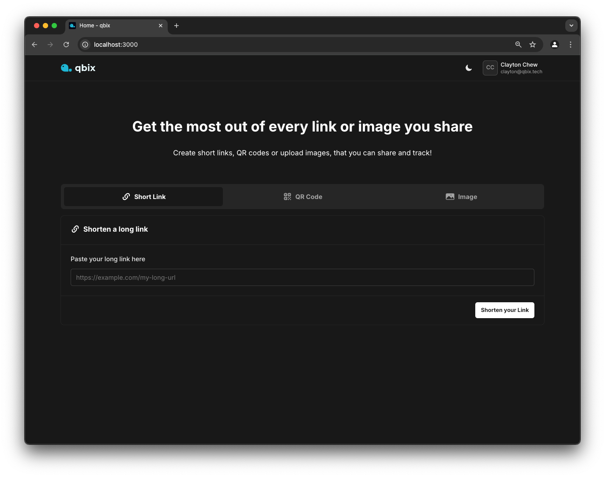
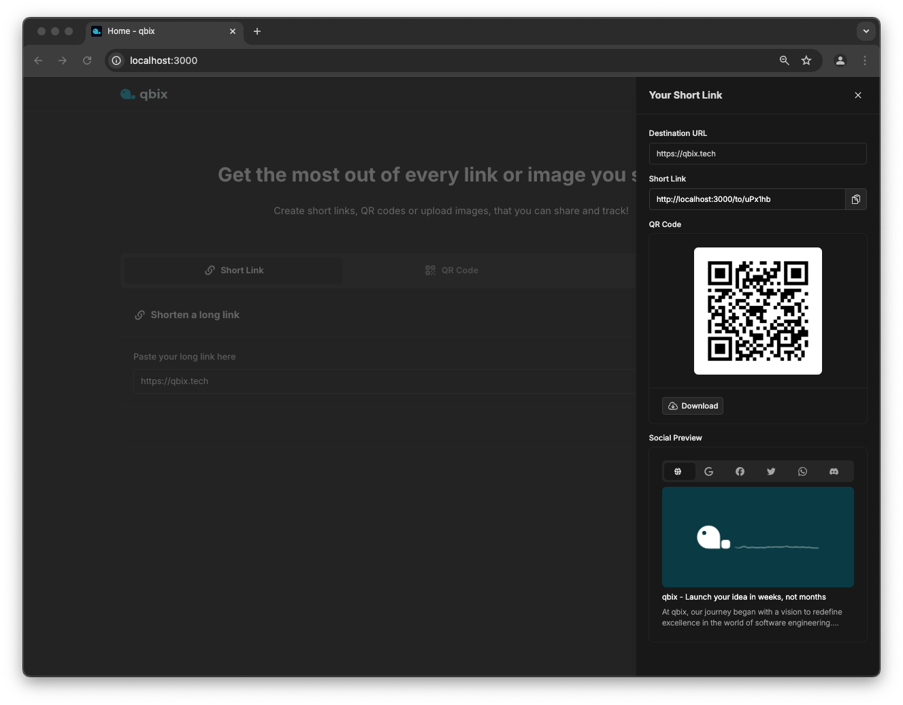
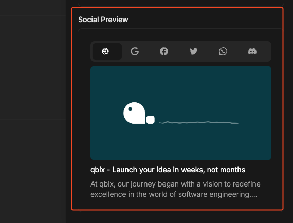
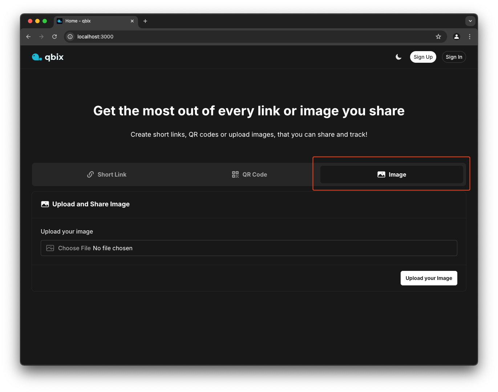
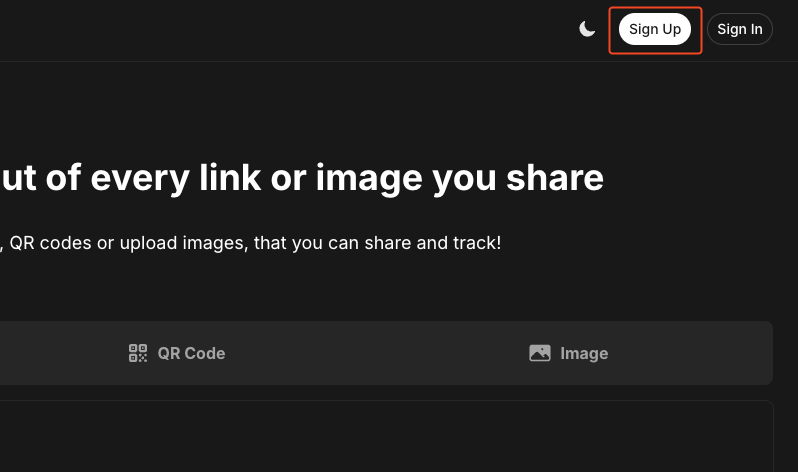

# Welcome!

Thank you for participating in this assessment. We are excited to learn more about you and what you can do! This project is hand-curated, meant to represent an actual full stack application, fitted with a database and a object store (S3), to help us understand your problem-solving skills, and how you approach and solve problems.

This project is designed to be **completed in 1 to 2 hours**. The time may vary depending on your skill level and how familiar you are with the common tools. To avoid with learning curve issues, we stick to tools that are considered to be common and the "de facto standard" in modern full-stack Nuxt web application development.

We understand you may have other commitments, please do not feel pressured to complete it in one sitting. We recommend that you complete the assessment **within 3 days of receiving it**. Do let us know if you require more time.

## Setting up your development environment

To get started, you will need to (or should) have the following installed on your machine:

- Node.js (v20 or higher)
- Docker Desktop – [Windows](https://docs.docker.com/desktop/install/windows-install/) | [Mac](https://docs.docker.com/desktop/install/mac-install/) (or powerful alternatives like [OrbStack](https://orbstack.dev/download)) | [Linux](https://docs.docker.com/desktop/install/linux/)

Go ahead and clone this repository to your local machine. Change directory into the project folder and run the following commands:

```bash
docker compose -f docker-compose.dev.yaml up -d
```

This command will start your development environment, which includes a lightweight libsql/Turso database, a MinIO object store (S3-compatible) and a smtp server that captures emails.

You can always stop the development environment at any time by running with `docker compose -f docker-compose.dev.yaml down`.

Next, copy the `.env.example` file to `.env`:

```bash
cp .env.example .env
```

The `.env.example` file already pre-populated with the necessary environment variables. You can leave them as is.

And finally, like any other Node.js based projects, install the dependencies:

```bash
npm install
```

Next, run the following command to deploy the database schema to the database:

```bash
npm run db:deploy
```

Don't worry about what this command does, we'll walk you through it later.

Finally, start the Nuxt development server:

```bash
npm run dev
```

You can now access the application at [http://localhost:3000](http://localhost:3000). Go ahead and try it out!

## The application



The application is a simple URL shortener + image hosting service, which allows users to shorten URL, create QR Code or upload an image to share with others.

Go ahead, let's try shorten a link, enter `https://qbix.tech` and click "Shorten your Link" button.



Notice when you click the "Shorten your Link" button, a post request is made to the server `POST /api/url`, which then returns a URL record object containing all the necessary data. With this data, we are able to feed into a slideover that displays the shortened URL.

In the slideover, other interesting thing also happens, on "open", a `GET /api/url/get-meta-tags` request is made to the server, which then returns actual meta tags of the website from the URL. This convenient api allow us to extract commonly used meta tags like `title`, `description`, `image`, etc. from the website. This allows us to display preview of the website on popular platforms such as Google, Facebook, Twitter, etc.



You also noticed that only the first two – Web and Google, are implemented. This is where your first task comes in – read further below!

## Task 1: Implement Social Previews

For your first task, you are required to implement social previews. This view should make use of the meta tags returned from the server to display a preview of the website on popular platforms such as Facebook, Twitter, WhatsApp, etc.

Fortunately, we have pre-created the components for you to get started, check out the `app/components/Card/SocialPreview` folder. You will find the following files:

- `Facebook.vue`
- `Twitter.vue`
- `WhatsApp.vue`
- `Discord.vue`

`Web.vue` and `Google.vue` are already implemented, you can use them as your starting reference. You can also refer to the api code in `server/api/url/get-meta-tags.get.ts` to see how the meta tags are being extracted from the website. You do not need to modify this api (but feel free to do so if required). Getting the meta tags to view is already done for you and you can access it from `props.data` of each component.

Go ahead, impress us. Once you're done, commit your changes as **a single commit** and push it to your private repository.

## Task 2: Drag and Drop Image Upload

Back to the beginning, we mentioned the application also allows users to upload image so that it can be shared via a URL. Go ahead and try it out!



Noticed that after selecting an image, the client makes a `POST /api/storage/upload/image` request to the server, which then returns an Image record object containing the `key` of the uploaded image. The `key` represents the identifier and the location of the image in the object store. With this `key`, we are able to reference the image in the object store.

When the user clicks on the "Upload your Image", the client doesn't actually uploads the image to the server anymore (it has already been done earlier), instead submits the `key` to the server to create a new URL record. Similar to Short Link and QR Code, we can also feed the URL record object into the slideover to display the URL of the image for user to share!

So the image upload does the thing it is supposed to do, but what if we could make it even better? What if we could allow users to drag and drop an image to upload? This is where your second task comes in!

We have pre-created the component for you to get started, check out the `app/components/ui/FileUpload.vue`. In the file, you will find doc comment stating:

```html
<!-- Usage: <FileUpload :accepts="['image', 'pdf', 'png']" @change="handleChange" /> -->
```

You task is to implement the drag and drop feature that aligns with the doc comment's "Usage" and replace the traditional file input on the form. Utility composable library `@vueuse` is also pre-installed in this project, you may use it to help you with the drag and drop feature.

Go ahead, impress us. Once you're done, commit your changes as **a single commit**.

## Task 3: Forgot Password

Now we are getting into the backend side of things. Do you noticed you could also sign up and account and sign in to the application?



Go ahead, click "Sign Up" on the top right of the site and try it out!

Upon signing up, an email is sent to your email address with a link to verify your email (to see your email, go to [http://localhost:28011/](http://localhost:28011/)). This is a common practice in web applications to ensure the email address is valid and belongs to the user.

To see how this works, check out the following files:

- `server/api/auth/signup.post.ts`
- `server/api/auth/verify-email.get.ts`

Behind the scene, upon signing up, apart from storing your credentials in the database, the server also generates a One-Time-Password (OTP) record to be used to verify your email. This OTP is then used to generate a link that is sent to your email address. Upon clicking the link, the server verifies the OTP and marks your email as verified.

> The email template is located at `email` folder in the root of the project. Template is rendered using `vue-email`, check out [Vue Email documentation](https://vuemail.net/getting-started).

Now, what if you forgot your password? This is where your third task comes in! Using the similar mechanism above, implement the "Forgot Password" feature on the user "Sign In" page.

If you inspect the project source code further (and we hope that you do!), you will find all database interactions are centrally managed in the `server/services/database` folder. Noticed that these are used by the server's API to interact with the database. You will also noticed that we have a database schema file `/database/schema.ts` that defines the database schema. To complete this task, you will need to understand how these work together.

Database is also managed using Drizzle ORM. For development environment, you can fast-forward changes on database schema changes, just like what you did at the beginning, by running:

```bash
npm run db:deploy
```

You can also view and explore the database with a neat graphical user interface by running the following:

```bash
npm run db:studio
# this will spin up drizzle studio accessible at https://local.drizzle.studio
```

You can check out [Drizzle documentation](https://orm.drizzle.team/docs/get-started) for more references.

Go ahead, impress us. Once you're done, commit your changes as **a single commit**.

## Task 4: Tracking visitor counts

Finally, we are entering to the advanced part of the assessment. Do you noticed that every URL record has a `count` field? This field represents the number of times the URL has been visited. This is a common feature in URL shorteners to track the number of times a URL has been visited. Each time when a user visits a shortened URL, the server increments the `count` field by 1.

Take a look at `server/routes/to/[shortCode].get.ts` file, you will find how the server handles the redirection of the shortened URL. Notice that the server also calls the `.incrementVisitCount()` method to increment the `count` field by 1 each time.

The `count` field isn't actually used yet to display the number of times the URL has been visited. However, what if we could make it even better? What if we could display the trend of the number of times the URL has been visited over time? This is where your fourth task comes in!

For this task, you will need to implement a new database schema that allow us to store the increment count of the URL over time. You will also need to implement and/or enhance the existing API to store and retrieve the count of the URL over time. With this data, you can then implement a line chart to display the trend of the number of times the URL has been visited over time.

Go ahead, impress us. Once you're done, commit your changes as **a single commit**. Remember to also generate the migration file for your schema changes and commit it as well. You can generate the migration file by running:

```bash
npm run db:generate
```

This is because in actual production, it generally recommended to run migrations instead of using the usual `npm run db:deploy`.

### ✨ Bonus Points

Bonus points if you can implement the trend line chart that listens to the real-time changes of the URL count. You can use Server-Sent Events (SSE) and hooks to achieve this. Have a look at h3's built in support for SSE [here](https://h3.unjs.io/guide/websocket#server-sent-events-sse) and [unjs/hookable](https://github.com/unjs/hookable) (already bundled with Nitro/Nuxt).

## Bonus Tasks (Optional)

If you have complete all the tasks above and still have time to spare, feel free to explore the project further and make any improvements or enhancements that you think would be beneficial to the project. You can also write tests for the project. We would love to see what you can come up with!

Some ideas:
- implement tests for the changes you have made above. (this project is already fitted with vitest, try running `npm run test:unit`)
- implement a feature to allow users to edit/delete their URL records. (take a look at Manage page upon signing in)
- etc.

## Submission

Once you have completed all the tasks, create a **private repository** on your GitHub account and push your changes to the repository.  Invite @claytonchew and @reynoldcky as a collaborator to the repository. Once you have done so, reply us an email with the link to the repository.

> 🚨 It is important that you do not fork this repository, but instead push to your own private repository to prevent others from copying your solutions.

We will review your submission and get back to you as soon as possible.
